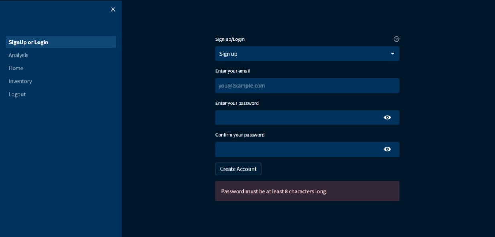
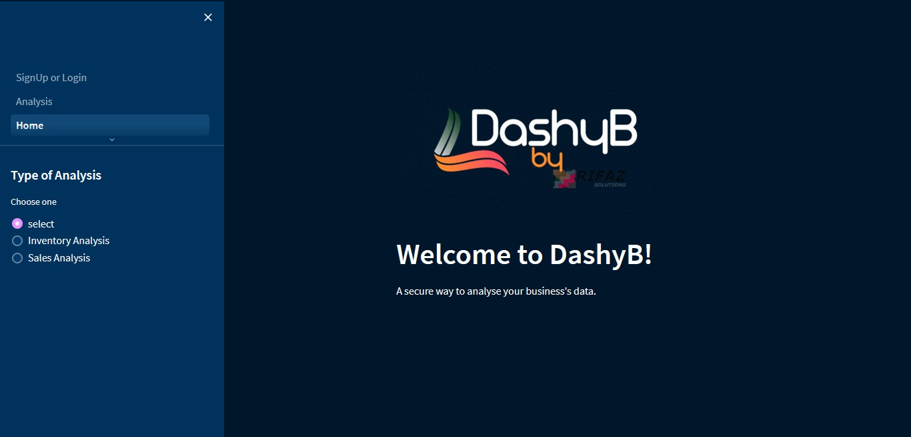
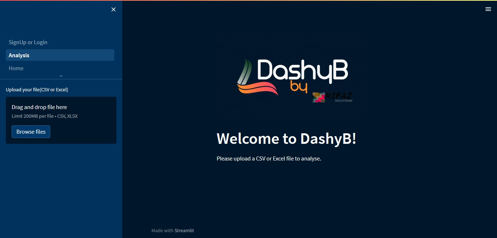
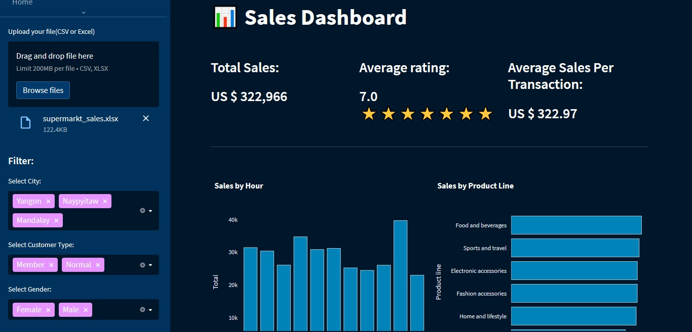

# DashyB

  

## Welcome to DashyB! 🎉 
This dashboard helps businesses upload Excel or CSV files and view various analyses, making data exploration a breeze. The app is built with Streamlit for a seamless user experience.

## Features 🌟

### Comprehensive Analyses Options

DashyB offers an array of analysis options tailored to meet the diverse needs of businesses. From inventory management to tax calculations, profit and loss assessments, and more, our dashboard empowers you with insightful visualizations that shed light on your data's key aspects.

### User-Friendly Upload Process

Uploading your data is effortless with DashyB. Simply navigate to the left-side upload section, and with a few clicks, your Excel or CSV files are seamlessly integrated into the app. Say goodbye to cumbersome data importing processes!

### Interactive Graphs and Visualizations

Our dashboard converts your raw data into interactive graphs and visualizations that communicate complex insights at a glance. Whether you're tracking sales trends or monitoring inventory fluctuations, DashyB's dynamic charts offer a clear picture of your business's performance.

### Streamlined Decision-Making

Equipped with DashyB's analyses, you're equipped to make informed decisions that drive your business forward. Whether you're identifying growth opportunities, pinpointing areas for improvement, or optimizing your tax strategy, our dashboard is your trusted ally in the decision-making process.

## Usage 🚀

1. Sign up through the online app.
2. Use the left-side upload section to upload files.
3. Choose the type of analysis you want to perform.
4. View the generated graphs and analyses.

## Technology Stack 🛠️

- pandas==1.5.3
- plotly==5.14.1
- streamlit==1.21.0
- openpyxl<=3.1.2
- requests==2.31.0
- pyrebase4<=4.6.0
- streamlit-extras<=0.2.7
- PyPDF2==3.0.1
- tabula-py==2.7.0
- requests-toolbelt==0.10.1

## Future Improvements 🚧

In the future, users will be able to create their own analyses.

## Screenshots 📷

Screenshots of the program below:

    
    

    
    

## License 📝

This project is licensed under the [MPL License.](https://opensource.org/licenses/MPL-2.0)
